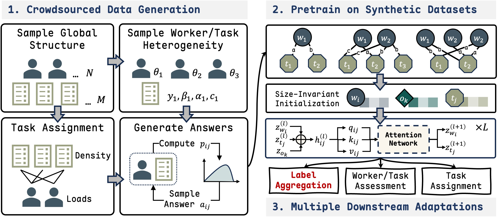

# CrowdFM

Official implementation for the ICLR 2026 paper:
**Towards a Foundation Model for Crowdsourced Label Aggregation**.



## Installation

```bash
uv sync
source .venv/bin/activate
```

## Usage

### Evaluate

By default, evaluation loads `checkpoint.pt`.

```bash
python evaluate.py
```

Optional:

```bash
python evaluate.py checkpoint_path=<path>
```

Results are written to `log/perform.json` by default.

### Train

```bash
python train.py --backup
```

Optional:

```bash
python train.py --backup --resume
```

```bash
python train.py --backup name=<experiment_name>
```

Training logs and checkpoints are saved under `log/<experiment_name>/` by default.

## Citation


```bibtex
@inproceedings{liu2026crowdfm,
    title={Towards a Foundation Model for Crowdsourced Label Aggregation},
    author={Liu, Hao and Liu, Jiacheng and Tang, Feilong and Chen, Long and Yu, Jiadi and Zhu, Yanmin and Dong, Qiwen and Yu, Yichuan and Hou, Xiaofeng},
    booktitle={The Fourteenth International Conference on Learning Representations (ICLR)},
    year={2026},
}
```
